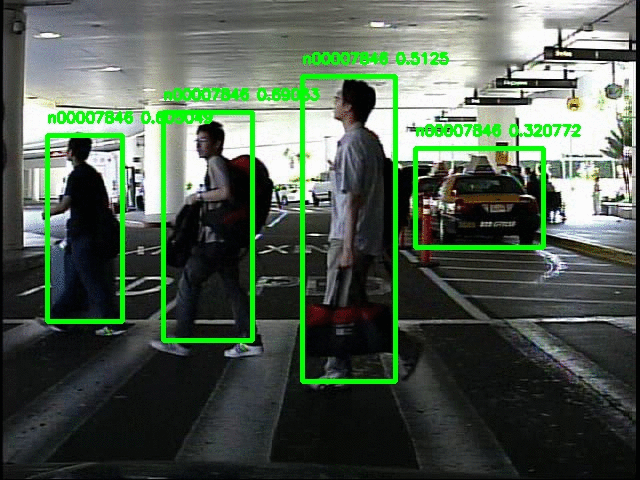

# Yolo_object_detection
Trained full Yolo  model on ImageNet dataset. 

# Yolo Model
The model and the trainin code cane be found here: https://github.com/experiencor/basic-yolo-keras  
I trained the model on the ImageNet Dataset for image detection that can be found here: http://image-net.org/challenges/LSVRC/2017/  
My trained model can be found here:  
In order to use the model on a video sequence you can run the predict_sequence_standalone.py  

# Example of usage
I used the trained model on Caltech pedestrain dataset and here is two example of preformance of model on two videos:

  
  

 
